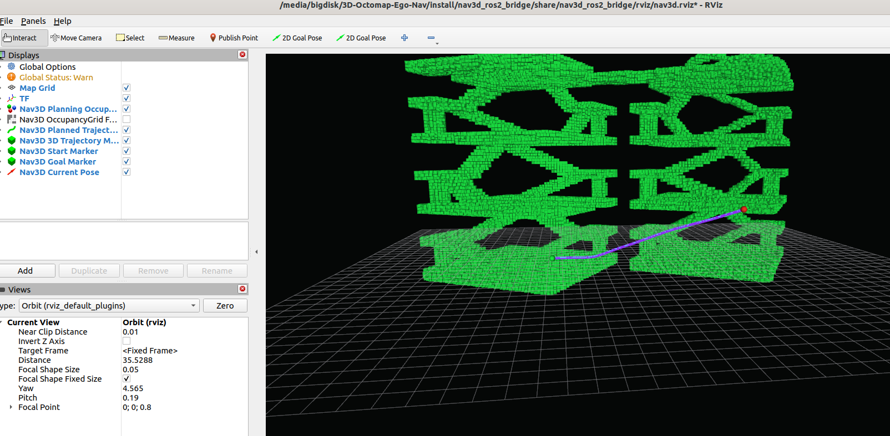
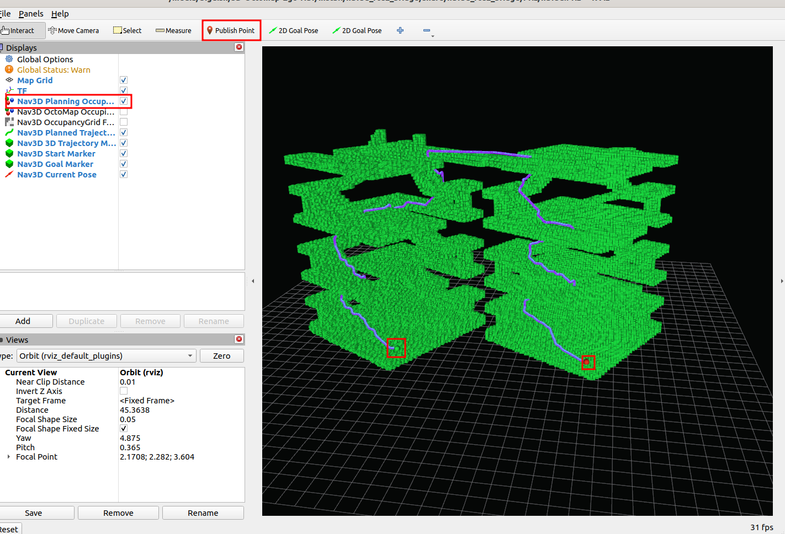
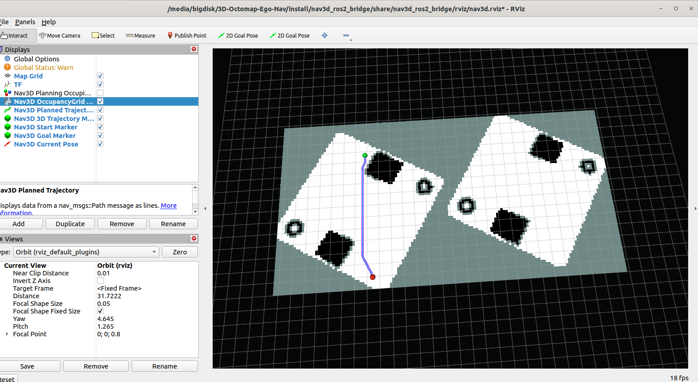

# 3D-Octomap-Ego-Nav

> 从 PCD 点云到 ROS2 / RViz / Web 的 2D/3D 导航原型，完整规划链路：A* warm-start B 样条 + L-BFGS + 局部 A* 替代 ESDF + 二次碰撞检测 + 事件触发式 safety replan。

```text
PCD 点云
  → 点云过滤 + Voxel/OctoMap 构建
  → 2D/3D A*（或 JPS）离散搜索
  → EgoPlanner 风格 B-spline warm start + L-BFGS 优化
  → 局部 A* rebound cue（替代 ESDF 梯度）
  → 二次轨迹碰撞检查 + fallback FSM
  → ROS2 bridge 发布 RViz / Web 可视化与控制 topic
```

---

## 5 分钟上手

| 你想做的 | 跳到 |
| --- | --- |
| 看一眼能跑成什么样 | [跑通主流程](#1-跑通主流程ros2--rviz) |
| 在浏览器选点 + 切换地图 | [Web 控制台](#2-web-控制台) |
| 模拟动态障碍触发 replan | [局部重规划演示](#3-局部重规划演示) |
| 把规划接到自己的下游 | [§ 7 下游对接](#7-下游对接) |
| 一行命令验证全部单测 | [§ 9 验证命令](#9-验证命令) |

---

## 1. 跑通主流程（ROS2 + RViz）

```bash
# 一次性构建 core + 单测
cmake -S . -B build -DNAV3D_BUILD_TESTS=ON
cmake --build build --target nav3d_core_tests -j2
ctest --test-dir build/core --output-on-failure

# 构建 ROS2 bridge
source /opt/ros/humble/setup.bash
colcon build --paths ros2_bridge/nav3d_ros2_bridge --packages-select nav3d_ros2_bridge
source install/setup.bash

# 启动 bridge + RViz（3D UAV 自由空间规划）
pcd_path="$(pwd)/reference/OctoPlanner3D-ROS2/octomap/pcd_files/building2_9.pcd"
ros2 launch nav3d_ros2_bridge nav3d_bridge.launch.py \
  pcd_path:="$pcd_path" planning_mode:=3d planning_traversability:=uav rviz:=true
```

在 RViz 中用顶部 **Publish Point** 点两次（起点、终点），bridge 会发布 `/nav3d/trajectory`。

> **三条先验：** ① 绿色体素层 `/nav3d/planning_occupied_markers` 就是规划用的碰撞图；② 2D ground 中灰色 `unknown` 不可通行，A*/JPS 不会跨过；③ 推荐先跑 ROS2/RViz 主链路，再看 Web UI。

预期截图：

| 模式 | 截图 |
| --- | --- |
| 3D UAV 自由空间 |  |
| 3D Ground 有支撑 |  |
| 2D Ground OccupancyGrid |  |

切换模式只需改 launch 参数：

```text
planning_mode := 2d | 3d
planning_traversability := uav | ground
search_algorithm := astar | jps
```

完整 launch 参数表见 [§ 8](#8-常用-launch-参数)。

---

## 2. Web 控制台

Web UI 是 RViz 之外的交互入口；适合输入精确 X/Y/Z 或在浏览器中做 3D 选点。**它只显示 bridge 返回的真实轨迹，不自己造规划线**。

```bash
# 终端 1：启动 bridge（保持 rosbridge=true，rviz 可关）
ros2 launch nav3d_ros2_bridge nav3d_bridge.launch.py \
  pcd_path:="$pcd_path" planning_mode:=3d planning_traversability:=uav \
  rosbridge:=true rosbridge_port:=9090 rviz:=false

# 终端 2：启动 Web
cd web_ui
npm install
npm run dev -- --port 5173
```

打开 `http://localhost:5173/`，自动连接 `ws://localhost:9090`，状态栏出现 **已连接** 即可。

**功能清单：**

| 入口 | 用途 |
| --- | --- |
| 左侧细栏 N3 | 品牌位 / ROS 状态指示灯 / 2D-3D 切换 / 清空 |
| 顶部 HUD | 场景标题 · plan 状态 chip（完整/部分/失败/待规划） · 启动 / 暂停 / 复位 |
| 左下角 minimap | OctoMap XY 投影 + 路径预览 + 起终点 + 机器人 |
| 右下角 HUD | 选点状态（命中 / 未命中） · 全局/局部/已走轨迹长度 · 体素和规划点计数 |
| 右侧 dock | ROSBridge 连接 / 地图下拉切换 / 起点目标录入 / 起点目标管理 / 地图层状态 / 轨迹与定位 |

**关键交互：**

- **选点**：先点「起点」按钮再在 3D 体素或地图平面上点一次；切回「目标」再点一次或多次；也可以用 X/Y/Z 数字输入。
- **地图切换**：右侧地图下拉框预置 4 张参考地图（Building 2-9 / Plaza 3-10 / Mock Corridor / Mock Stairs），选中后向 `/nav3d/load_pcd_path` 发布 PCD 路径并清空当前规划。需要别的 PCD 时展开「自定义 PCD 路径」。
- **路径分色**：全局路径（钴蓝）、局部路径（紫红，前方 ≈ 2.5 m）、已走轨迹（暗灰半透明，自动淡出）。
- **机器人定位**：当 bridge 持续发布 `/nav3d/current_pose`，已走线段会随机器人前进而消失，剩余轨迹被高亮。
- **partial / failed 提示**：plan_chip 颜色变化，下方 inline-warning 给出原因建议。

> Web 控制台「运行控制」不是底盘控制器；它做的是浏览器端按 `/nav3d/trajectory` 做轨迹回放和进度观察。真正参与运行时局部避障的是 ROS 侧 `/nav3d/current_pose` 和 `/nav3d/local_pointcloud`。

---

## 3. 局部重规划演示

要验证「障碍出现 → safety_replan → 绕行 / 急停」这条链路，跑内置 smoke 脚本：

```bash
# 终端 1：保持 bridge 运行（同上）
# 终端 2：
ros2 run nav3d_ros2_bridge nav3d_local_replan_smoke.py
```

预期看到 `/nav3d/status` 顺序出现：

```text
local_pointcloud_updated  →  safety_replan_needed
  ├─ safety_replan_success     # 局部障碍可绕行，bridge 发布新轨迹
  └─ safety_replan_emergency_stop  # 障碍阻断，bridge 停止 tracking 并零 cmd_vel
```

要看「机器人沿轨迹走一段、已走线段淡出、局部障碍周期刷新」的连续演示：

```bash
ros2 run nav3d_ros2_bridge nav3d_local_replan_smoke.py \
  --follow-trajectory --follow-speed 1.0 \
  --follow-local-update-interval 1.0 \
  --follow-local-obstacle-count 4 --follow-local-side-offset 0.3
```

更多 flag（随机障碍、严格绕行、阻塞测试）见脚本 `--help`。

### 局部障碍跟随 smoke

模拟 robot 沿规划轨迹推进，每 5s 在前方与左右生成一组 world-anchored 障碍（5m 后自动丢弃）：

```bash
pcd_path="$(pwd)/reference/OctoPlanner3D-ROS2/octomap/pcd_files/building2_9.pcd"
ros2 launch nav3d_ros2_bridge nav3d_local_replan_smoke.launch.py \
  pcd_path:="$pcd_path"
```

默认参数：
- 起点 `(-12, 3.19, 0.351)`，终点 `(8.16, 0.418, 0.351)`，z 不通过时自动 snap 到 `1.0`
- 每 5s 在 robot 当前位姿前方/左/右 spawn 3 个 sticky cluster
- robot 走出 5m 后丢弃 sticky cluster
- 启动后第 1s 不 spawn（warmup），避免堵住第一帧规划

可调参数：`world_anchored_obstacles`、`world_anchored_spawn_interval`、`world_anchored_drop_distance`、`world_anchored_warmup_seconds`、`follow_speed`、`snap_z_fallback`。

---

## 4. 核心语义（必读）

- **`planning_mode`** 决定搜索维度：`2d` 在 XY 平面，`3d` 允许 Z 方向运动。
- **`planning_traversability`**：
  - `uav`：空中自由空间。点位在地图边界内、不 occupied、满足膨胀半径即可。
  - `ground`：贴地/有支撑。除了避障还要求采样点有可支撑的地面结构。
- **2D ground OccupancyGrid 不再把整个 OctoMap 外接矩形当 free**：只有 ground-supported 且有 clearance 的格子是 `0 free`，其他是 `-1 unknown` 或 `100 occupied`，对应 RViz 的白/灰/黑。
- A*/JPS 搜索边和 B-spline 最终轨迹都按地图分辨率做连续空间采样检查，避免线段穿过薄障碍。

> **结论：** 规划是否能连通要看当前 traversability 下的可通行图，不是看 OctoMap 外接矩形是否覆盖了这片区域。

---

## 5. 目录结构

| 路径 | 内容 |
| --- | --- |
| `core/` | ROS-free C++ core：PCD loader、preprocessing、`VoxelGridMap`、`OctomapManager`、`LocalGrid`、`MapComposite`、A*/JPS、B-spline optimizer、trajectory checker、safety monitor、motion model、`TrajectoryTracker` |
| `core/planner_core/src/bspline/bspline_optimizer.cpp` | A* warm-start + L-BFGS + rebound cue 的核心实现 |
| `core/planner_core/src/ego_planner_core.cpp` | 全链路串接 + 二次碰撞 + fallback FSM |
| `core/controller_core/src/safety_monitor.cpp` | 沿轨迹前向碰撞预警 + 急停决策 |
| `ros2_bridge/nav3d_ros2_bridge/` | ROS2 Humble bridge：加载地图、调用 core、发布 RViz/Web topic、launch/config/RViz 配置 |
| `ros2_bridge/nav3d_ros2_bridge/scripts/nav3d_local_replan_smoke.py` | 局部障碍 + safety replan 自检脚本 |
| `web_ui/` | React 19 + Three.js Web 控制台，通过 rosbridge 选点并显示 bridge 返回轨迹 |
| `tools/` | ROS-free 可执行 demo（`nav3d_octomap_trajectory_demo` 等） |
| `imgs/` | RViz 验证截图 |
| `reference/` | 第三方参考实现 + 参考 PCD（不进 git） |

参考 PCD：

```text
reference/OctoPlanner3D-ROS2/octomap/pcd_files/building2_9.pcd
reference/OctoPlanner3D-ROS2/octomap/pcd_files/plaza3_10.pcd
tools/testdata/mock_corridor_map.pcd
tools/testdata/mock_stairs_map.pcd
```

---

## 6. Bridge Topic 合约

```text
# 发布
/nav3d/planning_occupied_markers  visualization_msgs/msg/MarkerArray   # 主 3D 占据
/nav3d/occupied_grid              nav_msgs/msg/OccupancyGrid           # 2D 投影
/octomap                          octomap_msgs/msg/Octomap
/nav3d/trajectory                 nav_msgs/msg/Path
/nav3d/trajectory_marker          visualization_msgs/msg/Marker
/nav3d/start_marker               visualization_msgs/msg/Marker
/nav3d/goal_marker                visualization_msgs/msg/Marker
/nav3d/status                     std_msgs/msg/String                  # 关键：plan_success / partial / safety_replan_*
/cmd_vel                          geometry_msgs/msg/Twist

# 订阅
/nav3d/start                      geometry_msgs/msg/PoseStamped
/nav3d/goal                       geometry_msgs/msg/PoseStamped
/clicked_point                    geometry_msgs/msg/PointStamped
/nav3d/current_pose               geometry_msgs/msg/PoseStamped
/nav3d/local_pointcloud           sensor_msgs/msg/PointCloud2
/nav3d/load_pcd_path              std_msgs/msg/String

# 服务 / 动作
/nav3d/plan_path                  nav_msgs/srv/GetPlan
/nav3d/navigate_to_pose           nav2_msgs/action/NavigateToPose
```

`/nav3d/status` 中典型 token：`plan_success`、`partial=true|false`、`plan_failed`、`safety_replan_needed`、`safety_replan_success`、`safety_replan_failed`、`safety_emergency_stop`、`tracking_goal_reached`、`local_pointcloud_updated`。

---

## 7. 规划链路 + 下游对接

### 7.1 一次完整规划

```text
start / goal
  → 选择全局规划图：VoxelGridMap 或 OctoMap
  → 可选叠加 LocalGrid → MapComposite
  → ground 模式再套 GroundTraversabilityMap
  → A* 或 JPS 搜索 2D/3D 离散路径
  → BsplineOptimizer::makeWarmStart()           // bspline_optimizer.cpp:439
  → L-BFGS 优化控制点 (lbfgsDirection)          // bspline_optimizer.cpp:404
  → buildReboundCues() 局部 A* 替代 ESDF 梯度    // bspline_optimizer.cpp:335
  → collision::TrajectoryChecker 二次连续采样   // ego_planner_core.cpp:300
  → fallback FSM：保守 path-following / 提高 collision_weight / 缩短目标 / EmergencyStop
  → 发布 /nav3d/trajectory 和 /nav3d/trajectory_marker
```

> **结论：** 你设想的「A* 撒点作为 B 样条控制点 + 同时作为 warm start + L-BFGS 优化 + 局部 A* 替代 ESDF + 二次碰撞 + 碰撞停机或缩短目标」整条链路在 core 里是完整实现的。详细文件级证据见 `.cc-tmp/backend-audit.md`（如未签入仓库，可重新生成）。

### 7.2 运行时安全闭环

要启用运行时局部能力，下游持续提供两类输入：

```text
/nav3d/current_pose       当前机器人位姿（frame_id=map）
/nav3d/local_pointcloud   局部感知点云（更新 LocalGrid）
```

`SafetyMonitor` 会沿当前轨迹向前检查；近距离碰撞 → 零 `/cmd_vel` + `safety_emergency_stop`；稍远碰撞 → `safety_replan_needed` → 从当前位姿到 active goal 重规划 → `safety_replan_success` 或 `safety_replan_emergency_stop`。

### 7.3 与 EGO Planner 的关系

| 模块 | 当前实现 | 与原版 EGO 的关系 |
| --- | --- | --- |
| 全局搜索 | A*/JPS 2D/3D | warm start 输入 |
| 轨迹表示 | Uniform B-spline | 一致 |
| 优化器 | L-BFGS two-loop recursion | 一致方向 |
| 避障梯度 | 局部 A* rebound cue + 地图碰撞代价 | **替代 ESDF 的工程化版本** |
| 二次检查 | `TrajectoryChecker` 连续采样 | 必须保留 |
| 局部重规划 | `SafetyMonitor` + `LocalGrid` 触发式 | 简化版，不是滚动 MPC |

要继续往生产级 EGO 推进，优先级：① 平台调 `planning.max_velocity/acceleration`+`enable_dynamic_feasibility_check`；② 接稳定 `/nav3d/local_pointcloud` 与 TF；③ 选择控制边界（`controller.motion_model:=diff_drive/omni`，无人机走轨迹 setpoint）。

### 7.4 下游接入三种模式

**A. 只要规划结果**

```bash
# topic
publish  /nav3d/start /nav3d/goal
subscribe /nav3d/trajectory /nav3d/status

# 或服务
ros2 service call /nav3d/plan_path nav_msgs/srv/GetPlan "{...}"
```

**B. 让 bridge 跟踪并输出 cmd_vel**

```bash
publish  /nav3d/current_pose /nav3d/local_pointcloud
send action /nav3d/navigate_to_pose
subscribe /cmd_vel /nav3d/status
```

`controller.command_frame := body | map`。本机闭环演示加 `cmd_vel_pose_sim:=true`。

**C. Nav2 风格 action**

```text
Action: /nav3d/navigate_to_pose
Type:   nav2_msgs/action/NavigateToPose
```

下游不要只看有没有 `/nav3d/trajectory`。至少同时检查：`plan_success / safety_replan_success / tracking_goal_reached`、是否出现 `plan_failed / trajectory_collision / safety_emergency_stop / safety_replan_failed`、`partial=false`、`/cmd_vel` frame 单位、`/nav3d/current_pose` 与 `/nav3d/local_pointcloud` 的 `frame_id` 时间戳与 TF。

> **核心判断：** 轨迹发布只说明 planner 给出了候选解；真正能执行要看 partial 状态、当前位姿闭环、下游控制接口、安全检查同时成立。

---

## 8. 常用 Launch 参数

```text
pcd_path:=...                     # PCD 路径
pcd_loader:=builtin               # builtin 或 pcl
resolution:=0.2                   # voxel/OctoMap 分辨率
planning_mode:=3d                 # 2d 或 3d
planning_traversability:=uav      # uav 或 ground
planning_use_octomap_map:=false   # false=内部 dense VoxelGridMap；true=OctoMap leaf
search_algorithm:=astar           # astar 或 jps
occupancy_grid_min_z:=0.2         # 2D OccupancyGrid 投影下限
occupancy_grid_max_z:=0.9         # 2D OccupancyGrid 投影上限
rviz:=true                        # 是否启动 RViz
rosbridge:=true                   # 是否启动 rosbridge websocket
rosbridge_port:=9090
config_path:=...                  # 高级参数 YAML
```

不常改的进阶参数在 `ros2_bridge/nav3d_ros2_bridge/config/nav3d_bridge.yaml`：`planning.*`、`local_grid.*`、`safety.*`、`controller.*`。

---

## 9. 验证命令

```bash
# Core 单测
cmake --build build --target nav3d_core_tests -j2
ctest --test-dir build/core --output-on-failure

# 局部 replan smoke（保持 bridge 运行）
ros2 run nav3d_ros2_bridge nav3d_local_replan_smoke.py
# 预期：outcome=safety_replan_success 或 safety_replan_emergency_stop

# Web UI
cd web_ui
npm install
npm test                     # vitest 单测（25 项）
npm run build                # tsc + vite build
npm run test:e2e             # Playwright（mock，无需 rosbridge）

# 真实 ROSBridge e2e（opt-in）
NAV3D_E2E_LIVE_ROSBRIDGE=1 \
npx playwright test e2e/navigation.spec.ts --project=desktop --grep "live ROSBridge"
```

ROS-free demo：

```bash
cmake --build build --target nav3d_octomap_trajectory_demo -j2
./build/tools/nav3d_octomap_trajectory_demo \
  --map-backend octomap --planning-mode 3d \
  --start -13 8 1 --goal 13 8 1 --resolution 0.2 \
  reference/OctoPlanner3D-ROS2/octomap/pcd_files/building2_9.pcd
```

---

## 10. 故障判断速查

| 症状 | 第一时间检查 |
| --- | --- |
| RViz 没显示绿色体素 | `ros2 topic info /nav3d/planning_occupied_markers`；display 是否开启 `Nav3D Planning Occupied Voxels`；RViz 配置是否来自当前安装后的 `nav3d.rviz`；改 RViz 配置/重建 bridge 后必须重启 launch |
| 2D 又变整块可通行 | 启动日志 `occupied_grid_published unknown=` 应 > 0；确认 `planning_traversability:=ground`；确认看的是 `/nav3d/occupied_grid`；确认 `occupancy_grid_min_z/max_z` 范围 |
| `plan_failed` / `partial=true` | `/nav3d/status` 中 `search_status=no_path`（起终点不在同一连通域 / ground support 过严）；或 `trajectory_collision`（B-spline 仍不通过最终碰撞检查）；`partial=true` 表示缩短目标 fallback |
| `safety_replan_failed` 但没 `safety_replan_emergency_stop` | safety 分支没有完成停机，优先修这条 |

---

## 11. 当前限制

- 这是可测试原型，不是完整生产级 Nav2 controller server 或真实底盘/飞控接口。
- RViz/Web/`cmd_vel` 本地模拟不等同真实机器人、Gazebo/Ignition 或硬件时钟同步验证。
- `search_algorithm:=jps` 已接入，但不声称在所有 reference PCD 上比 A* 更快。
- `partial=true` 是明确的缩短目标 fallback，不应解释为到达 requested goal。
- 运行时局部规划依赖 `/nav3d/current_pose` 和 `/nav3d/local_pointcloud` 的质量；下游不提供则只能执行静态图上的规划结果。
